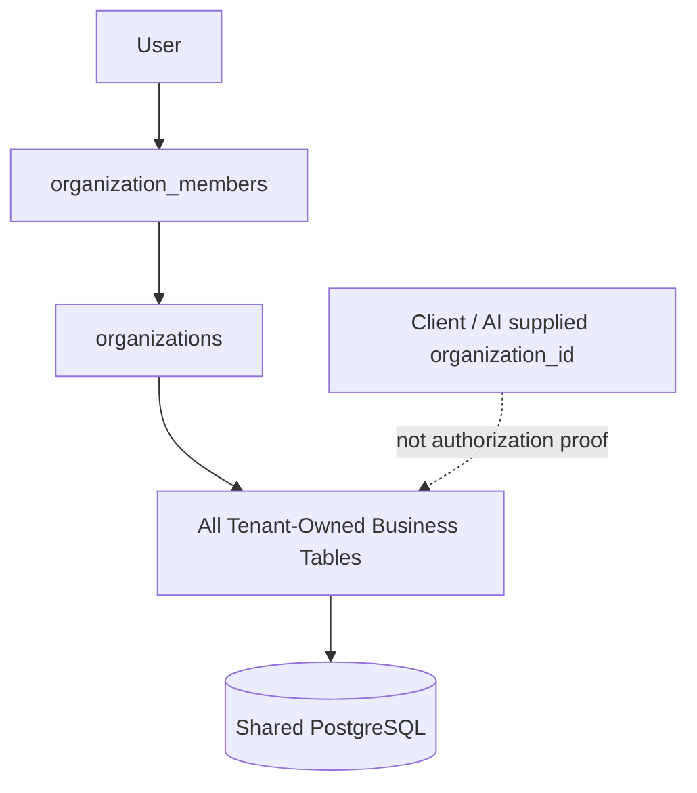
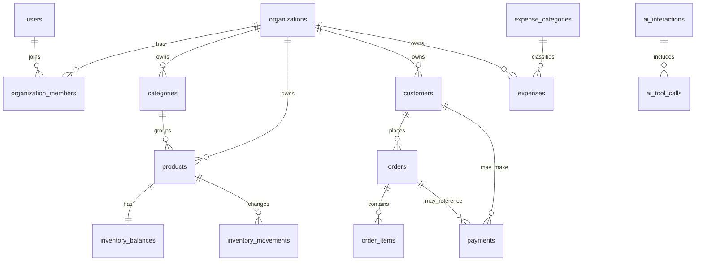
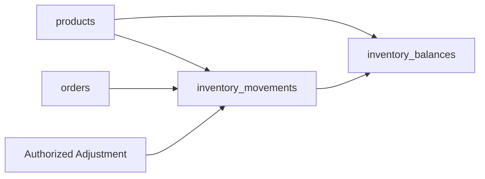
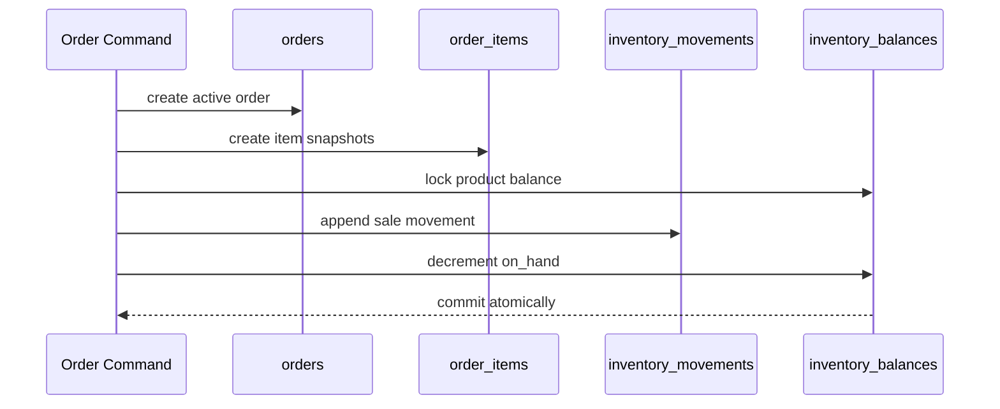
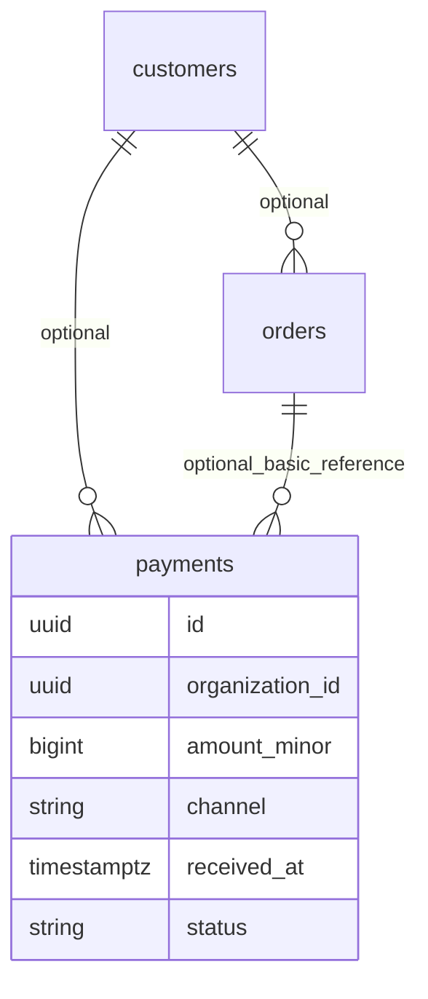
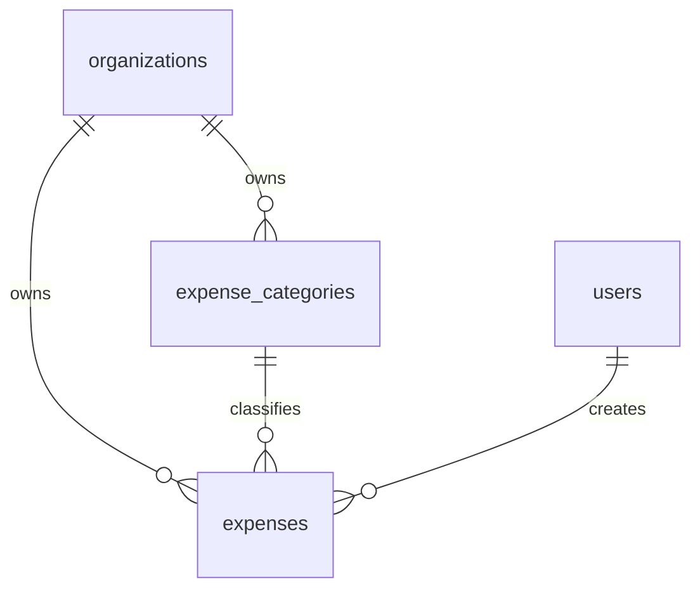
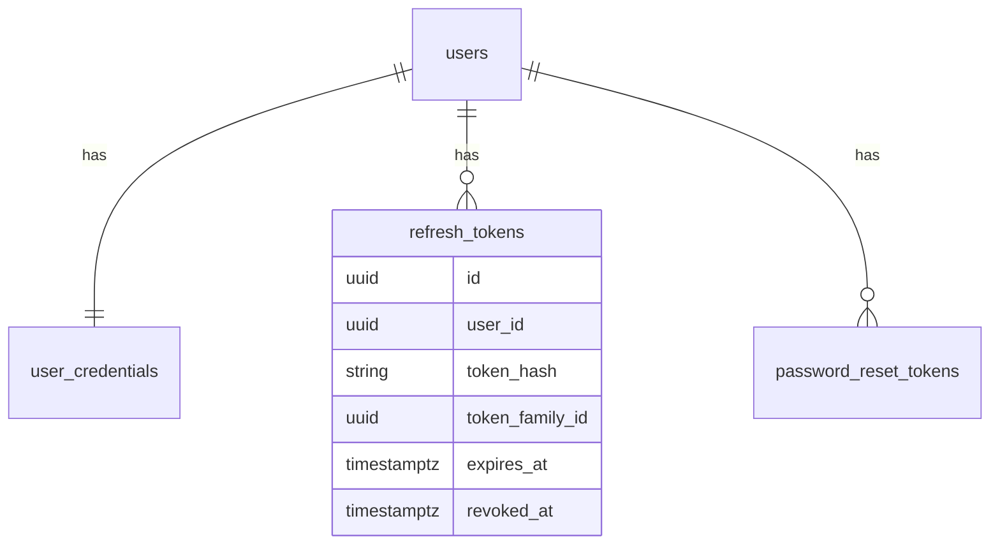
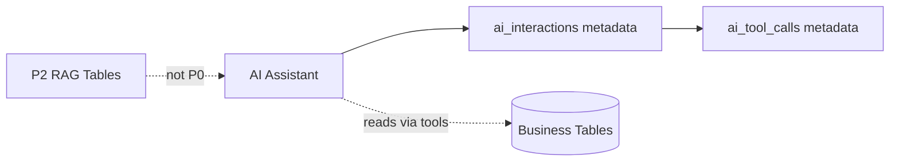
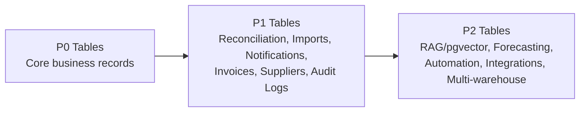

# BizPilot AI Database Design

Version: 1.0
Date: 18 September 2026
Status: Draft / Requires Human Approval
Source of truth: `docs/prd/PRD.md`, `docs/architecture/SYSTEM-ARCHITECTURE.md`, and `docs/architecture/AI-ARCHITECTURE.md`.

## 1. Purpose

This document defines the logical PostgreSQL database design for BizPilot AI P0. It describes entity boundaries, relationships, constraints, indexing, transaction strategy, tenancy, security and extension paths.

This is not an implementation artifact. It does not create SQL, SQLAlchemy models, Alembic migrations, repositories, services or seed data.

## 2. Scope

P0 database scope covers:

- Authentication persistence.
- Organizations and team members.
- Products and categories.
- Inventory balances and movements.
- Customers.
- Orders and order items.
- Recorded payments.
- Expense categories and expenses.
- Minimal AI metadata.
- Minimal internal traceability.
- Idempotency records.

Deferred:

- P1 full Payment Reconciliation, Suppliers, Purchase Orders, Invoices, Advanced Analytics, Notifications, CSV/Excel Import and user-facing Audit Logs.
- P2 WhatsApp, forecasting, RAG/pgvector, automation, POS, multi-warehouse, advanced reporting and external integrations.

## 3. Design Principles

- PostgreSQL is authoritative.
- Financial values use integer minor units.
- No floating-point money.
- Tenant-owned data is explicitly organization-scoped.
- Business records preserve history.
- Inventory balances cannot be changed without a movement.
- Customer balances are derived, not independently editable.
- Database constraints complement application validation.
- P0 schema remains bounded and avoids P1/P2 schemas.
- AI metadata is minimal and is not AI memory.

## 4. P0/P1/P2 Boundaries

P0 tables may reserve identifiers, references and lifecycle fields that keep future changes possible.

P1 tables not built in P0:

- Suppliers.
- Purchase Orders.
- Invoices.
- Payment Reconciliation.
- Advanced Analytics.
- Notifications.
- CSV/Excel Import.
- User-facing Audit Logs.

P2 tables not built in P0:

- WhatsApp integration.
- Forecasting.
- RAG/pgvector.
- Automation.
- POS.
- Multi-warehouse.
- Advanced reporting.
- External integrations.

## 5. PostgreSQL Architecture

Approved baseline:

- PostgreSQL primary database.
- SQLAlchemy persistence layer.
- Alembic migrations later.

Not P0:

- MongoDB.
- Cassandra.
- Elasticsearch.
- Separate analytics database.
- Vector database.
- pgvector.
- Event database.

PostgreSQL stores all authoritative P0 business records.

## 6. Multi-Tenancy

Model: shared PostgreSQL with strict logical tenant isolation.

Rules:

- Every tenant-owned business table contains `organization_id` directly unless a future design explicitly documents an exception.
- Organization context is derived from authenticated membership.
- Client/model-supplied `organization_id` is never authorization proof.
- Repositories/domain services must scope tenant-owned queries by organization.
- Tenant consistency uses foreign keys, composite constraints, indexes and domain validation.

RLS is not mandatory for P0. PostgreSQL Row-Level Security may be evaluated later as defense-in-depth, but P0 security must not depend on future RLS.

## 7. Identifier Strategy

Use UUID primary keys.

Recommendation:

- Prefer UUIDv7 for new core entities if supported cleanly.
- Use UUIDv4 as implementation fallback if UUIDv7 creates tooling complexity.
- Do not introduce distributed ID infrastructure.

Use human-friendly tenant-scoped references where useful:

- `order_number`.
- Future public invoice or import references if approved.

Public references are not substitutes for primary keys.

## 8. Money Representation

Authoritative money uses integer minor units with BIGINT-compatible representation.

Examples:

- `amount_minor`.
- `unit_price_minor`.
- `line_total_minor`.
- `order_total_minor`.

Use `currency_code` where financial records need currency context. P0 baseline is `PKR`.

Never use FLOAT/REAL for authoritative money. Do not build full multi-currency accounting in P0.

## 9. Timestamp/Timezone Strategy

Store authoritative timestamps as PostgreSQL `timestamptz` with UTC semantics.

Organizations store business timezone. Initial Pakistan baseline may use `Asia/Karachi`.

Business-event timestamps are separate from persistence timestamps:

- `ordered_at`.
- `received_at`.
- `occurred_at`.
- `created_at`.
- `updated_at`.
- `voided_at` where applicable.

Reporting periods resolve organization-local business dates into explicit UTC query ranges.

## 10. Entity Overview

Recommended P0 tables:

- `users`
- `user_credentials`
- `refresh_tokens`
- `password_reset_tokens`
- `organizations`
- `organization_members`
- `categories`
- `products`
- `inventory_balances`
- `inventory_movements`
- `customers`
- `orders`
- `order_items`
- `payments`
- `expense_categories`
- `expenses`
- `idempotency_keys`
- `internal_trace_events`
- `ai_interactions`
- `ai_tool_calls`

## 11. Users

Purpose: application identity.

Logical fields:

- `id` UUID PK.
- `email_normalized` unique.
- `display_name`.
- `status` such as active, disabled, pending.
- `created_at`, `updated_at`, `last_login_at`.

Lifecycle:

- Deactivate where historical references exist.
- Do not cascade-delete historical business records.

## 12. Organizations

Purpose: tenant boundary and business workspace.

Logical fields:

- `id` UUID PK.
- `display_name`.
- `currency_code` default `PKR`.
- `timezone` default `Asia/Karachi`.
- `status`.
- `created_at`, `updated_at`.

Constraints:

- Required display name.
- Valid timezone and currency code.

## 13. Organization Members

Purpose: user membership and RBAC.

Logical fields:

- `id` UUID PK.
- `organization_id` FK.
- `user_id` FK.
- `role` owner, manager, staff.
- `status` active, revoked, invited.
- `invited_by_user_id`.
- `created_at`, `updated_at`, `revoked_at`.

Constraints:

- Unique active membership per organization/user.
- Last-owner protection enforced by domain service transaction.

## 14. Categories

Purpose: lightweight product grouping.

Logical fields:

- `id` UUID PK.
- `organization_id` FK.
- `name`.
- `status` active, archived.
- `created_by_user_id`.
- `created_at`, `updated_at`, `archived_at`.

Constraints:

- Tenant-scoped unique active category name.

Delete strategy: archive, not destructive delete.

## 15. Products

Purpose: saleable countable product catalog.

Logical fields:

- `id` UUID PK.
- `organization_id` FK.
- `category_id` nullable FK.
- `code`.
- `name`.
- `base_unit`.
- `default_price_minor`.
- `currency_code`.
- `status` active, archived.
- `created_by_user_id`.
- `created_at`, `updated_at`, `archived_at`.

Constraints:

- Tenant-scoped unique active product code.
- Default price non-negative.

Historical orders keep product snapshots when products change.

## 16. Inventory Balances

Purpose: efficiently readable current stock.

Logical fields:

- `id` UUID PK.
- `organization_id` FK.
- `product_id` FK.
- `on_hand_quantity`.
- `version` for optimistic concurrency if used.
- `updated_at`.

Constraints:

- Unique `product_id`.
- Non-negative `on_hand_quantity`.
- Product and balance must belong to same organization.

Balances are updated only with corresponding inventory movement inside one transaction.

## 17. Inventory Movements

Purpose: append-style traceability explaining stock changes.

Logical fields:

- `id` UUID PK.
- `organization_id` FK.
- `product_id` FK.
- `movement_type` opening, sale, adjustment, correction, void_reversal.
- `quantity_delta`.
- `source_type` such as order, adjustment, correction.
- `source_id` UUID where applicable.
- `reason`.
- `created_by_user_id`.
- `created_at`.

Constraints:

- Non-zero quantity delta.
- Required reason for manual adjustments/corrections.
- Product and movement must belong to same organization.

## 18. Customers

Purpose: lightweight customer records.

Logical fields:

- `id` UUID PK.
- `organization_id` FK.
- `display_name`.
- Optional contact fields.
- `status` active, archived.
- `created_by_user_id`.
- `created_at`, `updated_at`, `archived_at`.

P0 allows orders without a named customer. Customer deletion/anonymization requires later privacy design while preserving transaction evidence.

## 19. Orders

Purpose: native/basic order or sale record.

Logical fields:

- `id` UUID PK.
- `organization_id` FK.
- `order_number` tenant-scoped public reference.
- `customer_id` nullable FK.
- `ordered_at`.
- `status` active, voided, corrected.
- `order_total_minor`.
- `currency_code`.
- `created_by_user_id`.
- Correction links such as `corrects_order_id` or `replaced_by_order_id`.
- `created_at`, `updated_at`, `voided_at`.

Constraints:

- Tenant-scoped unique `order_number`.
- Total non-negative.
- Customer, if present, must belong to same organization.

No e-commerce integration behavior in P0.

## 20. Order Items

Purpose: immutable line-level order evidence.

Logical fields:

- `id` UUID PK.
- `organization_id` FK.
- `order_id` FK.
- `product_id` nullable FK.
- Product snapshot fields: `product_name_snapshot`, `product_code_snapshot`, `unit_snapshot`.
- `quantity`.
- `unit_price_minor`.
- `line_total_minor`.
- `currency_code`.

Constraints:

- Positive quantity.
- Non-negative unit price.
- Deterministic line total.
- Order/item organization consistency.

P0 persists final agreed unit price. No full discount/promotion engine.

## 21. Payments

Purpose: recorded business receipts.

Logical fields:

- `id` UUID PK.
- `organization_id` FK.
- `customer_id` nullable FK.
- `order_id` nullable FK for simple P0 association.
- `amount_minor`.
- `currency_code`.
- `received_at`.
- `channel` cash, bank_transfer, digital, other.
- `account_label`.
- `external_reference`.
- `notes`.
- `status` active, voided, corrected, pending_duplicate_review if needed.
- Correction links.
- `created_by_user_id`.
- `created_at`, `updated_at`, `voided_at`.

Payments do not claim bank verification, settlement verification, external matching or reconciliation.

## 22. Payment Allocations

P0 does not implement full `payment_allocations`.

Decision:

- Do not create full allocation/reconciliation workflow in P0.
- Optional `payments.order_id` may support simple association to one order.
- Full many-to-many allocation, matching, exceptions, settlement evidence and reconciliation statuses are P1.

This section remains as an explicit boundary so P0 payment recording does not become P1 Payment Reconciliation.

## 23. Expense Categories

Purpose: lightweight expense grouping for P0 dashboard visibility.

Logical fields:

- `id` UUID PK.
- `organization_id` FK.
- `name`.
- `status` active, archived.
- `created_at`, `updated_at`.

Constraints:

- Tenant-scoped unique active name.

Keep lightweight; do not create accounting chart-of-accounts.

## 24. Expenses

Purpose: simple operating expense records.

Logical fields:

- `id` UUID PK.
- `organization_id` FK.
- `expense_category_id` nullable FK.
- `amount_minor`.
- `currency_code`.
- `occurred_at`.
- `payment_method`.
- `payee`.
- `description` or notes.
- `status` active, voided, corrected.
- Correction links.
- `created_by_user_id`.
- `created_at`, `updated_at`, `voided_at`.

Constraints:

- Positive amount.
- Category, if present, belongs to same organization.

No general ledger, journal entries, payroll, tax accounting, supplier accounting or procurement accounting.

## 25. Authentication/Session Data

Tables:

- `user_credentials`.
- `refresh_tokens`.
- `password_reset_tokens`.

`user_credentials`:

- `user_id` FK.
- `password_hash`.
- `password_updated_at`.
- Credential status fields.

`refresh_tokens`:

- hashed refresh token.
- user ID.
- token family ID.
- revoked/rotated metadata.
- expiry.
- created/revoked timestamps.

`password_reset_tokens`:

- hashed reset token.
- user ID.
- expiry.
- consumed timestamp.

Never store plaintext passwords or raw refresh/reset tokens where hashing is applicable.

## 26. AI Metadata

P0 AI metadata tables:

- `ai_interactions`.
- `ai_tool_calls`.

`ai_interactions` stores minimal metadata:

- `id` UUID PK.
- `organization_id`.
- `user_id` where appropriate.
- `trace_id`.
- `model_identifier`.
- token usage.
- estimated cost.
- outcome/error category.
- latency.
- `created_at`.

`ai_tool_calls`:

- `id` UUID PK.
- `ai_interaction_id` FK.
- `organization_id`.
- tool name.
- authorization result.
- latency.
- outcome/error category.
- `created_at`.

Do not assume raw prompt/response retention. Do not create embeddings, document chunks, vector indexes, pgvector columns or RAG persistence.

## 27. Relationships

Relationship summary:

- Users belong to organizations through memberships.
- Organizations own all tenant business records.
- Categories group products.
- Products own inventory balance and movements.
- Orders contain order items and drive inventory movements.
- Customers optionally relate to orders and payments.
- Payments may optionally reference one order in P0.
- Expenses may optionally reference an expense category.
- AI metadata references organization and user but does not store business truth.

Composite tenant consistency is required where child rows reference tenant-owned parents.

## 28. Constraints

Recommended constraint classes:

- `NOT NULL` for required fields.
- `UNIQUE` for global email and token hashes.
- Tenant-scoped `UNIQUE` for product codes, category names and order numbers.
- `CHECK amount_minor > 0` for payments/expenses.
- `CHECK unit_price_minor >= 0`.
- `CHECK quantity > 0`.
- `CHECK on_hand_quantity >= 0`.
- `CHECK status IN (...)` or enum-equivalent approach.
- Foreign keys for all stable relationships.
- Composite constraints to protect same-organization relationships where practical.

Do not rely only on Pydantic or application validation.

## 29. Transaction Boundaries

Atomic boundaries:

- Organization creation plus initial owner membership.
- Team role changes with last-owner protection.
- Order creation plus order items plus inventory movement plus inventory balance update.
- Inventory adjustment plus movement plus balance update.
- Payment recording plus duplicate/reference checks plus trace event.
- Expense creation plus trace event.
- Void/correction operations plus linked replacement/reversal records.
- Idempotency key claim plus business operation.

AI calls are outside core business transactions.

## 30. Concurrency

Use PostgreSQL transactions and row locking where appropriate.

Inventory:

- Lock affected `inventory_balances` rows for stock-changing operations.
- Reject operations that would produce negative available stock.

Orders:

- Idempotency prevents duplicate submissions.
- Order and stock effects commit together.

Payments:

- Duplicate external reference checks run transactionally where enabled.

Avoid distributed locking.

## 31. Idempotency

Use `idempotency_keys` for retry-sensitive writes.

Logical fields:

- `id` UUID PK.
- `organization_id`.
- `user_id`.
- `operation`.
- `idempotency_key`.
- `request_hash`.
- `status`.
- `result_reference_type`.
- `result_reference_id`.
- `created_at`, `expires_at`.

Constraints:

- Unique `(organization_id, user_id, operation, idempotency_key)`.
- Conflicting request hash reuse is rejected.

Initial operations:

- Order creation.
- Payment recording.
- Expense creation.
- Inventory adjustment.

No idempotency machinery for ordinary reads.

## 32. Index Strategy

Prioritize real P0 access patterns.

Recommended indexes:

- Tenant-owned tables: `organization_id`.
- Date queries: `(organization_id, ordered_at)`, `(organization_id, received_at)`, `(organization_id, occurred_at)`, `(organization_id, created_at)`.
- Products: `(organization_id, code)`, `(organization_id, category_id)`.
- Categories: `(organization_id, name)`.
- Customers: `(organization_id, display_name)` or normalized search column.
- Orders: `(organization_id, order_number)`, `(organization_id, customer_id, ordered_at)`.
- Payments: `(organization_id, received_at)`, `(organization_id, customer_id)`, optional `(organization_id, external_reference)`.
- Expenses: `(organization_id, occurred_at)`, `(organization_id, expense_category_id)`.
- Inventory: `(organization_id, product_id)`.
- AI metadata: `(organization_id, created_at)`, trace ID.

Avoid speculative over-indexing.

## 33. Delete/Archive Strategy

Lifecycle strategy:

- Users: deactivate where historical references exist.
- Organizations: lifecycle status; deletion workflow later.
- Products/categories: archive.
- Customers: archive/anonymize according to later privacy requirements while preserving transaction evidence.
- Orders/payments/expenses: void/correct/status lifecycle, not destructive deletion.
- Inventory movements: preserve historical movement records.
- Auth tokens: revoke/expire and purge by retention policy.
- AI metadata: retention TBD.

Do not cascade-delete business history.

## 34. Referential Integrity

Do not use `CASCADE` everywhere.

Guidelines:

- Restrict deletion of records referenced by financial/inventory history.
- Use nullable references only where product requirements allow optionality.
- Preserve historical snapshots on order items even if products are archived.
- Use `ON DELETE RESTRICT` or equivalent for most business-history parents.
- Use controlled cleanup for expired auth tokens and AI metadata according to retention.
- AUTH-owned credential/session/reset records use restrictive/default foreign-key delete semantics from users. User lifecycle is deactivate-first (`users.status = 'disabled'`). Hard deletion, if introduced later, requires explicit controlled cleanup and must not rely on implicit CASCADE.

## 35. Tenant Isolation

Tenant isolation at database design level:

- Direct `organization_id` on tenant-owned tables.
- Tenant-scoped unique constraints.
- Tenant-leading indexes.
- Composite relationships where practical.
- Repository patterns requiring organization scope.
- Optional future RLS evaluation.

Security must work without RLS.

## 36. Database Security

Plan:

- Least-privilege application DB role.
- Separate migration role if operationally justified.
- Encrypted DB connections.
- Secrets outside repository.
- Protected/encrypted backups.
- No plaintext passwords or raw tokens.
- Minimize sensitive columns.
- Organization-scoped query patterns.
- Redacted database/application logs.

RLS is optional defense-in-depth, not required P0 enforcement.

## 37. Dashboard Query Strategy

P0 dashboard uses deterministic source data.

Initial approach:

- Direct aggregate queries over orders, payments, expenses and inventory balances.
- Date-range filters derived from organization timezone.
- Tenant-scoped indexes.

Possible future optimization:

- Simple read models or materialized summaries if measured query cost requires it.
- No separate analytics warehouse in P0.

## 38. P1 Extension Strategy

P1 may add:

- `suppliers`.
- `purchase_orders`.
- `purchase_order_items`.
- `invoices`.
- Payment reconciliation allocation/status tables.
- Advanced analytics read models.
- Notification tables.
- CSV/Excel import jobs.
- User-facing audit log views/tables.

P0 should not create these prematurely.

## 39. P2 Extension Strategy

P2 may add:

- WhatsApp integration tables.
- Forecast datasets/results.
- RAG tables, document chunks, embeddings and pgvector columns.
- Automation workflow definitions/runs.
- POS integration schemas.
- Multi-warehouse locations, transfers and stock balances.
- Advanced reporting read models.
- External integration connections/events.

## 40. Backup/Recovery

Architecture must include:

- Automated PostgreSQL backups.
- PITR where provider supports it.
- Encrypted/protected backups.
- Restore testing.
- Restore verification.

Restore verification should check:

- Core row counts.
- Financial totals on sample data.
- Inventory movement/balance consistency.
- Tenant isolation assumptions.

Retention, RPO and RTO remain TBD founder/security decisions. Do not invent SLA values.

## 41. Migration Strategy

Use Alembic for migrations after implementation approval.

Principles:

- Review migrations before applying.
- Avoid destructive migrations without backup and approval.
- Keep migrations deterministic.
- Include rollback/forward-fix strategy where appropriate.
- Validate schema in CI once CI exists.

No Alembic files are created by this design task.

## 42. Database ADRs

### ADR-DB-001: PostgreSQL Authority

- Decision: PostgreSQL is the authoritative P0 data source.
- Consequence: No separate analytics/vector/event database in P0.

### ADR-DB-002: UUID Primary Keys

- Decision: Use UUID PKs, prefer UUIDv7 where cleanly supported.
- Consequence: Public references remain separate tenant-scoped fields.

### ADR-DB-003: Money as Integer Minor Units

- Decision: Store authoritative money as BIGINT-compatible minor units.
- Consequence: No floating-point money storage.

### ADR-DB-004: Explicit Tenant Ownership

- Decision: Tenant-owned tables carry `organization_id` directly.
- Consequence: Query safety, indexing and authorization are simpler.

### ADR-DB-005: Inventory Movement + Balance

- Decision: Movement ledger explains stock changes; balance supports fast reads.
- Consequence: Stock edits require movement and transaction consistency.

### ADR-DB-006: Payments Are Recording Only

- Decision: P0 payments are recorded receipts with optional one-order association.
- Consequence: Full allocation/reconciliation tables are P1.

### ADR-DB-007: Derived Customer Balance

- Decision: Do not store editable customer balance.
- Consequence: Balance-like answers derive from transactions.

### ADR-DB-008: Minimal AI Metadata

- Decision: Keep `ai_interactions` and `ai_tool_calls` minimal.
- Consequence: No raw prompt/response or RAG persistence required in P0.

## 43. Risks

- Accidentally building P1 reconciliation or audit schemas in P0.
- Tenant leakage from inconsistent scoping.
- Inventory drift if balances are edited directly.
- Duplicate writes without idempotency.
- Over-indexing before real usage.
- Under-defined retention/deletion rules.
- Customer balance being mistaken for stored truth.
- RLS complexity if adopted prematurely.

## 44. Assumptions

- P0 is single-location; multi-warehouse is P2.
- Countable integer product quantities are sufficient for P0.
- PKR is baseline currency.
- Dashboard can start with direct aggregates and indexes.
- Final RBAC matrix will be designed before implementation.
- Legal retention and deletion requirements remain TBD.
- SQLAlchemy and Alembic will be introduced in later implementation tasks.

## 45. Open Questions

- Whether UUIDv7 support is clean enough in chosen implementation libraries.
- Exact status enum implementation approach.
- Final auth token/session retention periods.
- Password/reset token expiry policy.
- Whether P0 payment `order_id` association is required in first implementation.
- Whether expense category is mandatory on each expense or optional.
- Whether internal trace events are generic table rows or domain-specific records.
- Backup retention, RPO and RTO.
- Whether RLS should be evaluated after the first repository patterns are implemented.

## 46. Founder Decisions Required

Already approved:

- UUID primary keys with UUIDv7 preferred where cleanly supported.
- Integer minor-unit money with PKR baseline.
- UTC `timestamptz` with organization timezone.
- Explicit tenant ownership through `organization_id`.
- RLS not mandatory for P0.
- Inventory movements plus balances.
- Negative stock rejected.
- Orders and order items with snapshots.
- P0 payments may optionally reference one order.
- No full payment allocations/reconciliation in P0.
- Customer balance is derived.
- Expense categories and expenses are P0.
- Auth persistence tables are approved conceptually.
- AI metadata tables are approved.
- Minimal internal trace events are approved.
- Idempotency keys are approved for retry-sensitive writes.
- P1/P2 schemas remain deferred.

Remaining founder/security decisions:

- Backup retention, RPO and RTO.
- Auth token/session/reset-token retention periods.
- Whether P0 first implementation uses payment-to-order association.
- Exact privacy/anonymization behavior for archived customers.
- Exact internal trace event retention and visibility.
